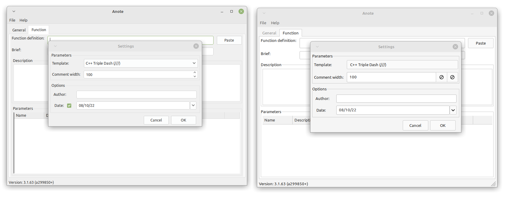

# ANOTE

Small utility for building code comments compatible with doxygen. It actually works with C++ and Python codes.

## Releases
Download latest release from the [release](https://github.com/lucsch/anote/releases/latest) page.

## Build instructions
You will need the following tools :

- A recent compiler for C++
- vcpkg (https://vcpkg.io/en/)
- CMake

### Install vcpkg

Step 1: Install vcpkg

Clone the vcpkg repository:

        git clone https://github.com/microsoft/vcpkg.git "$HOME/vcpkg"
        cd "$HOME/vcpkg"

Bootstrap vcpkg:

        ./bootstrap-vcpkg.sh

(Optional, but recommended) Integrate vcpkg with your system:

        ./vcpkg integrate install

Setup environment variables

        export VCPKG_ROOT="$HOME/vcpkg"

### Needed libraries on Linux

        sudo apt install install autoconf libtool 
        sudo apt install libx11-dev libxft-dev libxext-dev libwayland-dev libxkbcommon-dev libegl1-mesa-dev libibus-1.0-dev libgles2-mesa-dev

### Create and build the Project / Solution

    mkdir cmake-build-release && cd cmake-build-release
    cmake -B [build directory] -S . -DCMAKE_TOOLCHAIN_FILE=[path to vcpkg]/scripts/buildsystems/vcpkg.cmake 
    cmake --build [build directory]
    cd [build directory]
    cpack -G DEB

### Screenshot

Anote GTK2 vs GTK3

