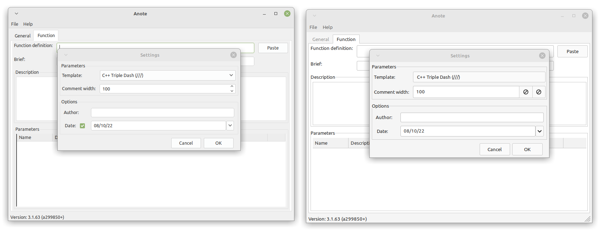

# ANOTE

Small utility for building code comments compatible with doxygen. It actually works with C++ and Python codes.

## Releases
Download latest release from the [release](https://github.com/lucsch/anote/releases/latest) page.

## Build instructions
You will need the following tools :

- A recent compiler for C++
- Conan (https://conan.io)
- CMake

### Install the libraries

    conan profile detect --force
    conan install . --build=missing -s build_type=Release

### Create and build the Project / Solution

    conan build . -s build_type=Release

For a debug build:

    conan install . --build=missing -s build_type=Debug
    conan build . -s build_type=Debug

### Screenshot

Anote GTK2 vs GTK3

