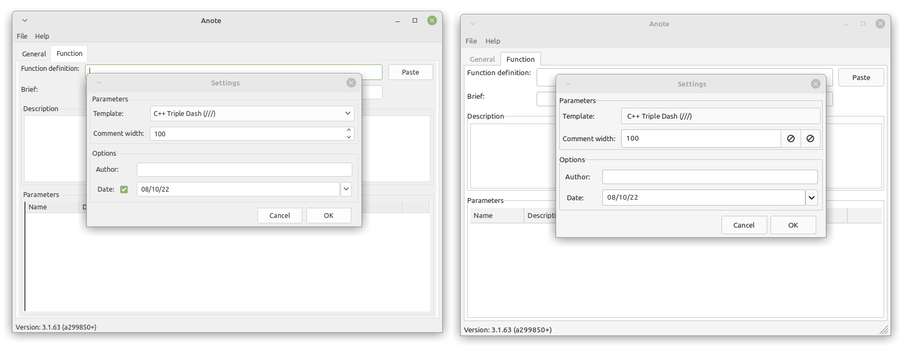

# ANOTE

Small utility for building code comments compatible with doxygen. It actually works with C++ and Python codes.


## Releases
Download latest release from the [release](https://github.com/lucsch/anote/releases/latest) page.

## Build instructions
You will need the following tools :

- A recent compiler for C++
- Conan (https://conan.io)
- CMake

### Install the libraries

    conan profile detect --force
    conan install . --lockfile=wxwidgets-conan.lock --build=missing -s build_type=Release

### Create and build the Project / Solution

    conan build . --lockfile=wxwidgets-conan.lock -s build_type=Release

For a debug build:

    conan install . --lockfile=wxwidgets-conan.lock --build=missing -s build_type=Debug
    conan build . --lockfile=wxwidgets-conan.lock -s build_type=Debug

### GitHub Actions and prebuilt dependencies

The workflows use the profiles from
[conan-profile](https://gitlab.com/terranum-conan/conan-profile).
Both `conan install` and `conan build` must use the same host and build profiles.

The recipe pins expat to 2.8.5 and, on Linux, libcurl to 8.21.0 to match the
dependencies of the wxWidgets 3.3.3 binaries published on ConanCenter. Selecting
a newer dependency minor version can change the package ID and prevent reuse
of an existing binary even when the compiler profile matches.

With these versions, the Release dependency graphs checked on 2026-10-07 have
prebuilt libraries for Windows (MSVC 194) and Linux (GCC 13). On macOS ARM64
(Apple Clang 17), libwebp 1.6.0 still needs compilation: its published ARM64
macOS binaries use Apple Clang 13. `--build=missing` builds only missing packages,
including any missing build tools. The workflows save and restore Conan package
archives through the GitHub Actions cache to reuse locally built packages.

To investigate a future missing binary, use the same profiles as the workflow:

```sh
conan graph explain . --lockfile=wxwidgets-conan.lock -pr:h=linux-x86_64-gcc13-release -pr:b=linux-x86_64-gcc13-release
conan list "wxwidgets/3.3.3:*" -r=conancenter
```

The shared `wxwidgets-conan.lock` freezes dependency versions and recipe revisions
for all three platforms, including build tools. Each workflow passes it explicitly
to both Conan commands, and its contents contribute to the GitHub Actions cache
key. Extra dependencies in this shared file are only used on platforms that
require them. Profiles and binary packages are not stored in the lockfile.

Review the pins and intentionally regenerate the lockfile when updating
wxWidgets or its dependencies. With Conan and the three profiles installed,
run the following commands from the repository root:

```sh
conan lock create . -pr:h=windows-x86_64-msvc194-release -pr:b=windows-x86_64-msvc194-release --lockfile="" --lockfile-out=windows.lock
conan lock create . -pr:h=macos-arm64-clang17-release -pr:b=macos-arm64-clang17-release --lockfile="" --lockfile-out=macos.lock
conan lock create . -pr:h=linux-x86_64-gcc13-release -pr:b=linux-x86_64-gcc13-release --lockfile="" --lockfile-out=linux.lock
conan lock merge --lockfile=windows.lock --lockfile=macos.lock --lockfile=linux.lock --lockfile-out=wxwidgets-conan.lock
```

The three intermediate `.lock` files can be discarded after merging. Validate
the resulting file with `conan graph info . --lockfile=wxwidgets-conan.lock
--build=missing` and both profile arguments for each platform, then commit the
updated lockfile. Do not regenerate it automatically during CI builds.

### Screenshot

Anote GTK2 vs GTK3


